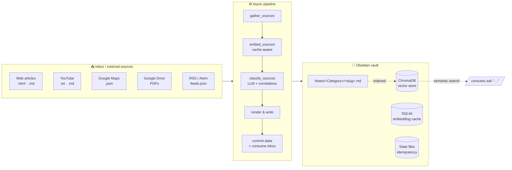
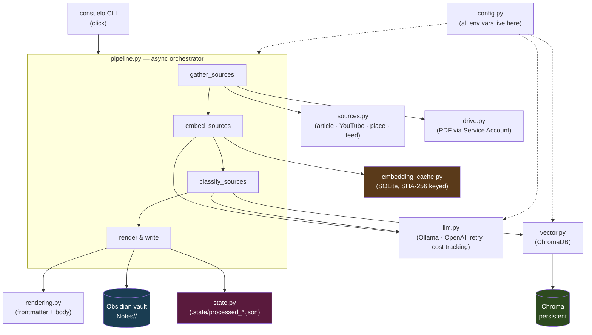

# Consuelo

> Turn your Obsidian vault into a self-organising knowledge base. Drop articles, YouTube videos, RSS items, Google Drive PDFs, or Maps places into an inbox — let an LLM classify, summarise, tag, and cross-link each one into the right folder, with semantic search across the whole vault.

[](https://www.python.org/)
[](LICENSE)
[](https://github.com/astral-sh/ruff)
[](#development)
[](#models)

---

## Why

Personal note-taking systems decay. You save things faster than you can file them; "read later" turns into "never read"; useful notes from months ago vanish because you don't remember the right keyword.

**Consuelo** is an opinionated automation layer on top of Obsidian that:

- 📥 **Ingests** content from 5 source types: web articles, YouTube transcripts, Maps places, Google Drive PDFs, RSS/Atom feeds.
- 🧠 **Classifies** each item with an LLM into one of your existing domain folders (or proposes a new one), generating a 3–5 sentence summary, kebab-case tags, and wiki-link correlations to related notes.
- 🔁 **Stays idempotent**: re-running the workflow only processes new items thanks to per-source state files.
- 🔎 **Lets you ask questions** over the whole vault via RAG (`consuelo ask "…"`) — answers are grounded in your notes with explicit `[[wiki-links]]` as citations.
- 🏠 **Runs fully local** by default (Ollama + ChromaDB + SQLite cache, zero external calls), or in **cloud mode** (OpenAI) when you need the speed.

The output is regular Obsidian markdown — your knowledge stays in plain files, portable forever.

---

## How it works



A typical run looks like this:

```
$ consuelo run
INFO mode=cloud, dry_run=False
INFO gathered 12 sources (8 article, 4 feed) in 1.4s
INFO embeddings: 9 cache hits, 3 API calls
INFO wrote Notes/Tech/Kubernetes-Operators-Pattern.md [article, Tech]
INFO wrote Notes/Finance/Fed-Rate-Cut-September.md [article, Finance]
…
INFO cost: $0.0042 (chat 1240/380 @ gpt-4o-mini | embed 2100 @ text-embedding-3-small)
```

---

## Highlights

| Feature | Detail |
|---|---|
| 🪪 **Two LLM backends** | Ollama (local, free, offline) or OpenAI (faster, ~$0.01 per 100 articles) — toggled by a single env var. |
| ⚡ **Async pipeline** | Embed + classify + URL fetch run concurrently. ~5× speedup on cloud mode vs. sequential. |
| 💾 **Content-addressed cache** | SHA-256 keyed SQLite cache for embeddings. Re-processing the same text costs zero API calls. |
| 🧭 **Auto-categorisation** | LLM is shown the existing folders under `Notes/` and reuses them — no near-duplicates ("AI" vs "Artificial Intelligence" collapse). Space/underscore normalisation prevents folder duplication. |
| 🔗 **Semantic correlations** | Each new note is linked to its top-K most similar existing notes via Chroma vector search. |
| 📰 **RSS-aware** | Top-N most-recent entries per feed, today-only date filter by default, falls back to fetching `entry.link` for headline-only feeds (TLDR, Hacker News). |
| 🗂️ **PDF from Drive** | Service-account integration — drop PDFs in a shared Drive folder, get them processed and archived automatically. |
| 🔁 **Idempotent** | Per-source state files (`.state/processed_*.json`) dedupe across runs. Safe to schedule via cron. |
| 💬 **RAG `ask`** | Natural-language Q&A grounded in your own notes with wiki-link citations. |
| 🌐 **Bilingual output** | Generated summary + tags match the input language (Italian → Italian, English → English, anything else → English). |

---

## Quick start

```bash
# 1 — Clone & install
git clone https://github.com/valeriouberti/consuelo.git
cd consuelo
python3.12 -m venv .venv && source .venv/bin/activate
pip install -e ".[dev]"

# 2 — Configure
cp .env.example .env                # edit VAULT_PATH, choose LLM_MODE, etc.

# 3 — Pick a backend
# Local (default) — install Ollama, pull models:
ollama serve &
ollama pull qwen2.5:14b
ollama pull nomic-embed-text-8k

# OR Cloud — set in .env:
#   LLM_MODE=cloud
#   OPENAI_API_KEY=sk-…

# 4 — Drop content & run
echo "<html>…</html>" > "$VAULT_PATH/Inbox/articles/my-article.html"
consuelo run
```

That's it. Output lands in `$VAULT_PATH/Notes/<Category>/<slug>.md`, ready to open in Obsidian.

---

## Commands

```bash
# Per-item processing (Inbox/ → Notes/<Category>/)
consuelo run
consuelo run --dry-run                  # render to stdout, no writes
consuelo run --mode cloud               # one-off override of LLM_MODE

# RAG over the indexed vault
consuelo ask "what have I read about Kubernetes operators?"
consuelo ask "places I want to visit in Berlin" -k 12

# Build / refresh the vector index (Notes/ + Daily/)
consuelo index
consuelo index --incremental            # only files modified since last run
consuelo index --no-daily               # Notes/ only
```

---

## Architecture at a glance



Full breakdown → [`docs/architecture.md`](docs/architecture.md).

---

## Output format

Each classified item becomes a self-contained markdown file:

```markdown
---
category: Tech
correlations:
  - '[[Notes/Tech/Python/FastAPI-Async-Patterns]]'
date_processed: '2026-05-14'
source: https://example.com/k8s-operators
tags:
  - kubernetes
  - operators
  - platform-engineering
title: Kubernetes Operators Pattern
---

## 📝 Summary _(generated 2026-05-14)_
> The Operator pattern packages Kubernetes-native automation as
> domain-specific controllers. It extends the control plane with
> custom resources whose state is reconciled by user code…

**Tags**: #kubernetes #operators #platform-engineering
**Related**: [[Notes/Tech/Python/FastAPI-Async-Patterns]]

---

# Kubernetes Operators Pattern

<original article body, preserved as markdown>
```

Folder placement is decided by the classifier and constrained to the categories that already exist under `Notes/` (the LLM is shown the list as a hint). Near-duplicate folder names are folded together (`System Design` ↔ `System_Design`) to keep the vault tidy.

---

## Configuration

All environment variables are read in `consuelo/config.py` (nothing reaches `os.environ` outside that module). Highlights:

| Variable | Default | Purpose |
|---|---|---|
| `VAULT_PATH` | `./vault` | Obsidian vault root. |
| `LLM_MODE` | `local` | `local` (Ollama) or `cloud` (OpenAI). |
| `OLLAMA_MODEL` / `OLLAMA_EMBED_MODEL` | `qwen2.5:14b` / `nomic-embed-text-8k` | Local models. |
| `OPENAI_MODEL` / `OPENAI_EMBED_MODEL` | `gpt-4o-mini` / `text-embedding-3-small` | Cloud models. |
| `ASYNC_CONCURRENCY` | 8 cloud, 1 local | Semaphore cap. |
| `EMBED_CHAR_LIMIT` | 20000 | Auto-shrinks long inputs to fit the embed model's context. |
| `FEED_MAX_ENTRIES_PER_FEED` | 3 | Top-N entries per RSS feed per run. |
| `FEED_DAYS_BACK` | 0 | `0` = today-only; `N>0` = backfill N days; `-1` = disable date filter. |
| `CHROMA_PATH` | `./vault/.chroma` | Where the vector store lives. |
| `LOG_LEVEL` | `INFO` | `DEBUG` for verbose tracing. |

Full reference → [`docs/configuration.md`](docs/configuration.md).

---

## Adding content

Each source type has its own conventions. See [`docs/sources.md`](docs/sources.md) for the full guide; quick links:

- 📄 **Web articles** — drop `.html` or `.md` into `Inbox/articles/`. Use the Obsidian Web Clipper or `curl`.
- 🎬 **YouTube** — `.txt` (URL only) or `.md` in `Inbox/youtube/`. Gathered today; per-item flow in the next iteration.
- 📍 **Maps places** — `.json` in `Inbox/places/`. Same status as YouTube.
- 📰 **RSS feeds** — declare them in `feeds.json` (path configurable via `FEEDS_CONFIG_PATH`).
- 📕 **Drive PDFs** — service-account auth, two folder IDs in `.env`, files move from `Inbox/PDFs/` to `Processed/PDFs/` after processing.

---

## RAG: ask your vault

```bash
$ consuelo ask "what distributed-consensus algorithms have I studied?"

You've covered Raft consensus in [[Notes/System_Design/Raft]] and the
foundational paper on Paxos in [[Notes/System_Design/Paxos]], with a
focus on leader election and log replication invariants…

## Sources
- [[Notes/System_Design/Raft]] — Raft consensus algorithm
- [[Notes/System_Design/Paxos]] — Multi-Paxos overview
```

The query is embedded → ChromaDB returns the top-K matches → the LLM answers in markdown with explicit `[[wiki-link]]` citations to your notes. Run `consuelo index` once before `ask` to populate the vector store.

Details on the prompt + retrieval strategy → [`docs/architecture.md#rag`](docs/architecture.md#rag).

---

## Models

| Mode | Chat model | Embed model | Speed | Cost |
|---|---|---|---|---|
| `local` (default) | `qwen2.5:14b` via Ollama | `nomic-embed-text-8k` | ~12s/article | $0 |
| `cloud` | `gpt-4o-mini` | `text-embedding-3-small` | ~2s/article | ~$0.01 / 100 articles |

The cost tracker (cloud mode only) logs an end-of-run summary:

```
INFO embedding cache: 17 hits
INFO cost: $0.0042 (chat 1240 prompt + 380 completion @ gpt-4o-mini
              | embed 2100 @ text-embedding-3-small)
```

Pricing is hard-coded in `llm.py::_PRICING_PER_1M_USD` — sync periodically with [OpenAI pricing](https://openai.com/api/pricing/).

---

## Project layout

```
consuelo/
├── consuelo/
│   ├── cli.py                 # click: run · ask · index
│   ├── config.py              # all env vars live here
│   ├── models.py              # Source dataclass
│   ├── sources.py             # extractors per source type
│   ├── drive.py               # Google Drive client
│   ├── llm.py                 # sync + async LLM, retry, cost
│   ├── embedding_cache.py     # SQLite cache
│   ├── vector.py              # ChromaDB wrapper
│   ├── rendering.py           # frontmatter + body assembly
│   ├── state.py               # idempotency
│   ├── archive.py             # category helpers
│   └── pipeline.py            # async orchestrator
├── prompts/                   # classify · ask · recap (LLM system prompts)
├── docs/                      # architecture, pipeline, sources, configuration
├── tests/                     # pytest (22 passing)
├── scripts/                   # one-off utilities
├── pyproject.toml             # hatchling, ruff, mypy, pytest
└── .env.example
```

Module-by-module breakdown → [`docs/architecture.md`](docs/architecture.md).

---

## Development

```bash
pip install -e ".[dev]"
pytest                  # 22 unit tests
ruff check .            # lint
ruff format .           # format
mypy consuelo       # types
```

Contributions welcome — open an issue first if it's a structural change.

---

## Automation

Run via cron (macOS / Linux):

```cron
0 7 * * * cd /path/to/consuelo && .venv/bin/consuelo run >> /tmp/sb.log 2>&1
```

GitHub Actions / Cloud Run / Kubernetes CronJob: the workflow is plain Python — just mount your vault and secrets. A reference workflow lives in [`docs/automation.md`](docs/automation.md).

---

## Roadmap

- [ ] Per-item flow for YouTube transcripts (currently gathered but not written).
- [ ] Per-item flow for Maps places (same).
- [ ] Pinecone backend as a swappable vector store.
- [ ] Hierarchical categorisation (sub-folders under `Tech/`, `System_Design/`, …).
- [ ] Reference GitHub Actions workflow for fully managed runs.

---

## License

MIT — see [LICENSE](LICENSE).

---

## Author

**Valerio Uberti** — [LinkedIn](https://www.linkedin.com/in/valeriouberti) · [GitHub](https://github.com/valeriouberti)

If this project is useful to you, a ⭐ on the repo means a lot.
