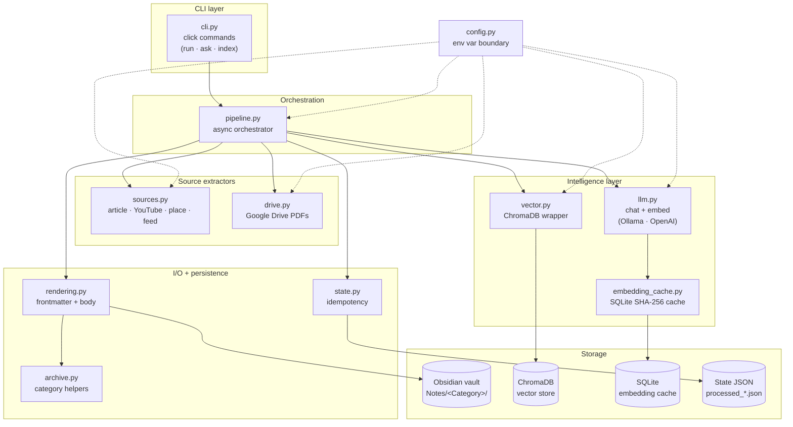
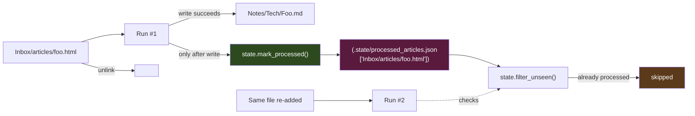
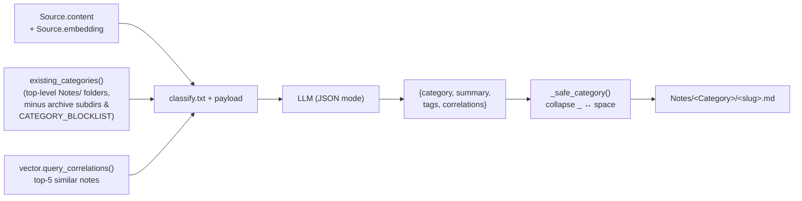
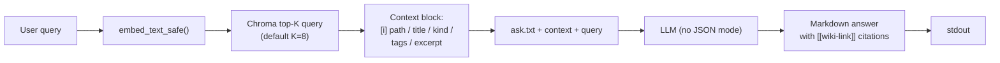

# Architecture

This document is the system-level companion to the [README](../README.md). It covers component responsibilities, control flow, and the design decisions that shaped them.

## Component map



## Module responsibilities

| Module | Responsibility |
|---|---|
| `cli.py` | Click commands. Translates CLI flags to env overrides, kicks off `asyncio.run`, reports cost + status at the end. |
| `config.py` | **Single boundary for `os.environ`.** Every other module asks `config.*()` for settings. Centralised so secrets handling, defaults, and validation live in one place. |
| `models.py` | The `Source` dataclass. One in-memory representation for every item from any source. |
| `sources.py` | Source-specific extractors (articles, YouTube, places, RSS feeds). Each returns `list[Source]`. |
| `drive.py` | Google Drive v3 client wrapped for service-account auth. Lists/downloads PDFs, moves processed files to an archive folder. |
| `llm.py` | Sync + async chat and embed wrappers around Ollama and OpenAI. Retry with exponential backoff on transient errors; cost tracker for cloud mode. |
| `embedding_cache.py` | Content-addressed SQLite cache keyed by `sha256(model_namespace ‖ text)`. Lossless float32 roundtrip via `struct`. |
| `vector.py` | ChromaDB persistent collection. Upsert-on-write, top-K query with cosine similarity. |
| `rendering.py` | Builds the final markdown file: frontmatter, summary, body, plus `safe_filename` / `_safe_category` sanitisation. |
| `state.py` | Per-source state files in `.state/processed_*.json`. Idempotency guarantee. |
| `archive.py` | `existing_categories()` (the folder hint passed to the classifier) and the legacy archive helpers. |
| `pipeline.py` | The async orchestrator. Owns the `gather → embed → classify → write → commit_state` lifecycle. |

## The per-item flow

This is what `consuelo run` executes today.

```mermaid
sequenceDiagram
    participant CLI as cli.py::run
    participant Pipe as pipeline.py
    participant Src as sources.py
    participant Drv as drive.py
    participant Feed as RSS feeds
    participant Cache as embedding_cache
    participant LLM as llm.py
    participant Vec as vector.py
    participant FS as Obsidian vault
    participant State as state.py

    CLI->>Pipe: gather_sources()
    par parallel
        Pipe->>Src: _gather_file_sources()
        Src-->>Pipe: article / youtube / place
    and
        Pipe->>Drv: gather_pdf_sources()
        Drv-->>Pipe: pdf sources
    and
        Pipe->>Feed: gather_feed_sources(target_date=today)
        Feed->>Feed: parse feeds, top-N per feed,<br/>state.filter_unseen()
        Feed-->>Pipe: feed sources
    end

    Pipe->>Pipe: embed_sources()
    loop per source (bounded by semaphore)
        Pipe->>Cache: get(sha256(text))
        alt cache hit
            Cache-->>Pipe: embedding
        else miss
            Pipe->>LLM: embed_text_async()
            LLM-->>Pipe: embedding
            Pipe->>Cache: put(sha256(text), embedding)
        end
    end

    Pipe->>Pipe: classify_sources()
    loop per source (bounded by semaphore)
        Pipe->>Vec: query_correlations(embedding, k=5)
        Vec-->>Pipe: related notes
        Pipe->>LLM: call_llm_async(classify prompt + related + categories)
        LLM-->>Pipe: {category, summary, tags, correlations}
    end

    Pipe-->>CLI: enriched sources

    loop per processable source
        CLI->>FS: write Notes/&lt;Category&gt;/&lt;slug&gt;.md
    end
    CLI->>State: commit_state(written)
    CLI->>FS: unlink inbox files
```

### Concurrency model

- **Source gathering** runs three branches in parallel (`asyncio.gather`): filesystem scan, Drive listing, RSS parsing.
- **Embedding** and **classification** are bounded by a shared `asyncio.Semaphore` whose limit is `ASYNC_CONCURRENCY` (8 cloud, 1 local).
- RSS parsing is synchronous (feedparser library), so each feed runs in a thread (`asyncio.to_thread`). URL fetches for headline-only feeds use a shared `httpx.AsyncClient`.

Local mode pins concurrency to 1 because Ollama serialises requests against the loaded model anyway — parallelism just adds overhead.

### Retry policy

`llm._retry_async` wraps each LLM call with up to **3 attempts**, exponential backoff (1 s · 2 s · 4 s). Only **transient errors** are retried (timeouts, `429`, `5xx`). Permanent errors (`401`, `400`) propagate immediately so misconfiguration surfaces fast.

The retry factory takes a coroutine builder, not a coroutine — because a coroutine can only be awaited once. Easy mistake to make; one of the early bugs we hit.

---

## Idempotency: state files



Each source type has its own state file under `vault/.state/`:

| Source | ID strategy | File |
|---|---|---|
| Articles | vault-relative path | `processed_articles.json` |
| YouTube | video URL | `processed_youtube.json` |
| Places | `place_id` (fallback: path) | `processed_places.json` |
| PDFs | Drive `fileId` (immutable across renames) | `processed_pdfs.json` |
| Feeds | entry `guid` or `link` | `processed_feeds.json` |

The pipeline never writes state pre-emptively — only after the markdown file is written. If a run dies mid-flight, nothing is lost: the next run resumes from where it left off.

---

## Categorisation



The classifier sees the current top-level folder list under `Notes/` and is instructed to **reuse** an existing name whenever the article fits. New categories are proposed only when no existing one fits.

Two safety nets keep the vault from fragmenting:

1. **Separator normalisation in `_safe_category`** — `System Design` and `System_Design` collapse to the existing folder when one already exists. Case-insensitive.
2. **Category blocklist** — folders that exist for non-topical reasons (e.g. `Snippets_Library`) are excluded from the hint list so the LLM never accidentally classifies into them.

Granularity guidance lives in `prompts/classify.txt`: keep categories at **domain level** (Tech, Finance, AI, System_Design), and encode specifics (Python, Bun, Kafka) as **tags**, not as their own folder.

---

## RAG: `ask` flow {#rag}



- The vector store is populated by `consuelo index` (one-off or `--incremental`).
- The query is embedded with the same model + namespace as the corpus, so the cache hits naturally on re-queries.
- The context block is structured deterministically so the LLM can cite hits by their wiki-link path verbatim.
- `ask.txt` is intentionally **not** JSON-mode: the answer is free-form markdown so it can include headers, lists, and inline citations.

---

## Why these choices

A handful of decisions that shaped the design:

- **Async over sync.** OpenAI in cloud mode benefits massively from concurrency (~5×). Ollama doesn't — but writing the pipeline async means switching modes is a single env-var flip.
- **Content-addressed cache.** Hashing the input text means re-running on the same vault is essentially free. The namespace prefix isolates models so changing `OLLAMA_EMBED_MODEL` doesn't poison the cache.
- **Chroma over Pinecone (for now).** Local-first by default. The `vector.py` interface is intentionally narrow so a Pinecone backend can drop in without touching the pipeline.
- **Per-item over daily-aggregate.** An earlier iteration generated one `Daily/YYYY-MM-DD.md` summary per day; it was harder to discover later and worse for RAG. Per-item notes land in a topical folder and are individually addressable.
- **No `print`. No `os.environ` outside `config.py`.** Two rules that pay off when running this under cron or in a container — every signal goes through `logging`, every secret has one read site.

---

## See also

- [`pipeline.md`](pipeline.md) — async pipeline deep dive.
- [`sources.md`](sources.md) — how each source type is extracted and how to add a new one.
- [`configuration.md`](configuration.md) — full environment variable reference.
- [`automation.md`](automation.md) — cron, GitHub Actions, container deployments.
