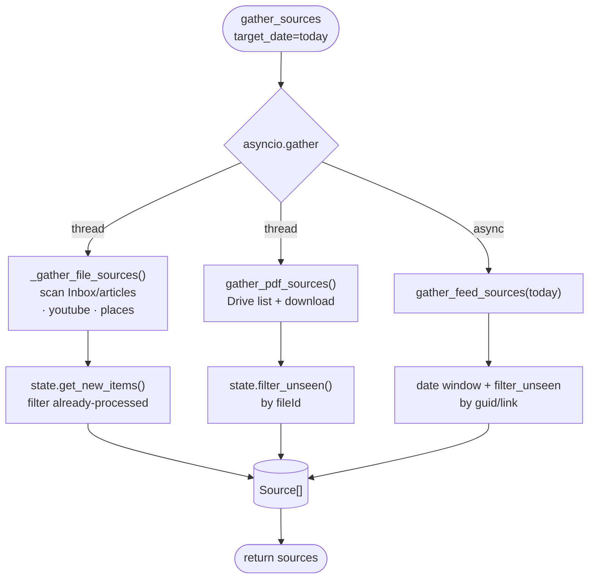
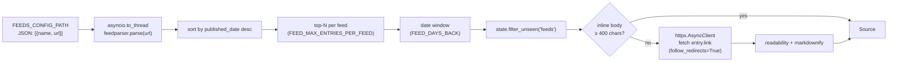
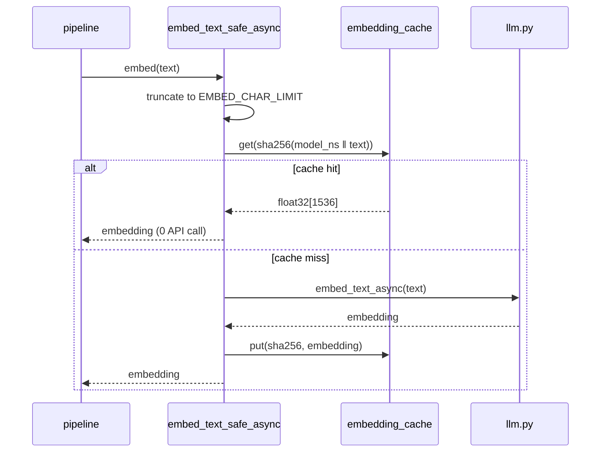
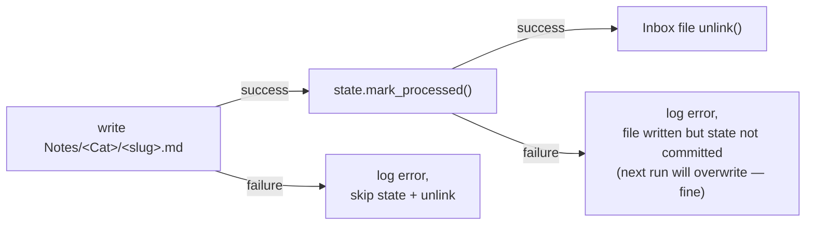

# Pipeline deep dive

A walkthrough of `pipeline.py` — what runs, in what order, with what concurrency, and where things can fail.

## Entry point

```python
async def _pipeline():
    sources = await gather_sources(target_date=date.today())
    if not sources:
        return sources
    await embed_sources(sources)
    await classify_sources(sources)
    return sources

sources = asyncio.run(_pipeline()) or []
```

Three stages, each operating on the same in-memory `list[Source]`. Each stage mutates the list in place (sets `Source.embedding`, `Source.category`, etc.); no copies, no streaming.

## Stage 1 — gather



### Article extractors (`sources.py`)

Articles come in two shapes:

- **`.html`** → `readability-lxml` extracts the main content, then `markdownify` converts it to markdown while preserving headings, lists, and links. Fallback to raw `text_content()` if `markdownify` is unavailable.
- **`.md`** → bypass readability; the body is markdown already. Frontmatter is parsed with `python-frontmatter` and used to populate `Source.title`, `Source.url`, and (optionally) `Source.extra`.

YouTube `.md` files are detected by URL-in-body or URL-in-frontmatter; transcript fetching uses `youtube-transcript-api` v1 (`YouTubeTranscriptApi().fetch(video_id)`, **not** the legacy `get_transcript` API).

### Drive PDFs (`drive.py`)

The Drive client authenticates via service account JSON (the SA's email must have Editor access on both the inbox and the processed folder — service accounts have no quota of their own). `list_inbox_pdfs()` returns file metadata; `download_pdf()` streams the bytes to a temp file; `pdfplumber` extracts text with heading detection by font size. After processing, `move_to_processed()` relocates the file on Drive — `fileId` is immutable across renames/moves so the state ID stays stable.

### RSS feeds (`sources.py::gather_feed_sources`)



Two complementary knobs control freshness:

1. **`FEED_MAX_ENTRIES_PER_FEED`** (default `3`) — per-feed cap on the *N* most-recent entries, regardless of date.
2. **`FEED_DAYS_BACK`** (default `0` — today only) — additional date window anchored on `target_date`.

State dedup applies after both filters, so re-running the same day only ever sees the delta.

Headline-only feeds (TLDR, some Hacker News variants) ship `summary` but not full content. The pipeline detects this (inline body < 400 chars) and fetches the linked URL. `follow_redirects=True` is essential — TLDR's redirector returns `308`.

## Stage 2 — embed

```python
async def embed_sources(sources: list[Source]) -> None:
    sem = asyncio.Semaphore(async_concurrency())
    async def one(s):
        async with sem:
            s.embedding = await embed_text_safe_async(s.content)
    await asyncio.gather(*(one(s) for s in sources))
```

Every source is embedded concurrently up to the semaphore limit. `embed_text_safe_async` handles three concerns transparently:

1. **Cache lookup** — content hashed (SHA-256) under the model namespace. Hit → 0 API calls.
2. **Length budget** — if the content exceeds `EMBED_CHAR_LIMIT`, it's truncated to fit. Same content + same truncation → same hash → still cacheable.
3. **Retry** — transient errors trigger up to 3 attempts with exponential backoff.

Cache lives in `vault/.cache/embeddings.db`. The key includes the model namespace (`cloud:text-embedding-3-small` vs `local:nomic-embed-text-8k`), so switching models doesn't return stale vectors. Safe to delete — rebuilds on miss.



## Stage 3 — classify

```python
async def classify_sources(sources):
    collection = vector.open_collection()
    categories = existing_categories()
    sem = asyncio.Semaphore(async_concurrency())

    async def one(s):
        async with sem:
            related = await asyncio.to_thread(
                vector.query_correlations, collection, s.embedding
            ) if s.embedding else []
            await _classify_one(s, related, categories)

    await asyncio.gather(*(one(s) for s in sources))
```

For each source the pipeline does two things, in sequence, inside the semaphore:

1. **Vector correlation query** — Chroma is sync (sqlite-backed), so the call is offloaded to a thread. Returns the top-K most similar notes already in the vault, with `path / title / kind / tags / distance`.
2. **LLM classification** — the classify prompt is rendered with the source content, the related notes (as wiki-link candidates), and the existing-category list, then sent to the LLM in **JSON mode**. The response is parsed; failures fall back to `category="Uncategorized"`, `status="llm_fail"`, and a placeholder summary.

The vector query and the LLM call must run sequentially for the same source (the LLM prompt depends on the query result), but **across sources** they're fully concurrent — the semaphore happens to govern both, which works out: each source's chain is independent.

## Stage 4 — write + state

This stage lives in `cli.py::run` rather than `pipeline.py` because it depends on CLI options (`--dry-run`).

```python
for s in processable:
    out_path = write_classified_note(s)
    written.append((s, out_path))

if written:
    commit_state([s for s, _ in written])
    for s, _ in written:
        if s.source_path and s.source_path.exists():
            s.source_path.unlink()        # consume the inbox file
```

Ordering matters:



The contract:

- **Write before state.** State is the canonical "is this done?" question — if it says yes, the file must exist.
- **State before unlink.** Inbox is the recovery path. If state commit dies and we've already deleted the inbox file, the next run can't re-process. Order matters.

## Failure modes

| What goes wrong | What happens | Recovery |
|---|---|---|
| Ollama not running | All embed calls fail; sources marked `embed_fail`. | `ollama serve &` and re-run. |
| OpenAI 429 | Backoff + retry up to 3×. If still failing, source marked `embed_fail` or `llm_fail`. | Re-run. |
| LLM returns invalid JSON | `parse_llm_json` falls back to first-`{`-to-last-`}` extraction. If still bad → `llm_fail`. | Inspect log; re-run consumes the same inbox file. |
| Inbox file disappears mid-run | Source's extractor returned content, write fails silently if path-bound. | Already-extracted source still classifies; write fails → state not committed → safe. |
| Chroma collection missing | Correlations come back empty; classification proceeds with `[]`. | Run `consuelo index`. |
| State file corrupt JSON | Loaded as empty → all items look new → potential reprocessing. | Restore from backup or accept the reprocessing. |
| Drive folder permissions | List/download raises; Drive sources skip with warning. | Verify SA email has Editor on both folder IDs. |

The pipeline as a whole is **idempotent under any of the above** as long as the write→state→unlink ordering holds.

## Cost tracking (cloud mode only)

`llm.py` keeps module-level counters for prompt tokens, completion tokens, embed tokens, and cache hits. `reset_usage()` at the start of each run; `usage_summary()` at the end logs:

```
INFO embedding cache: 17 hits
INFO cost: $0.0042 (chat 1240 prompt + 380 completion @ gpt-4o-mini
              | embed 2100 @ text-embedding-3-small)
```

Pricing comes from `_PRICING_PER_1M_USD` — sync manually with [OpenAI pricing](https://openai.com/api/pricing/).

## Performance notes

- **Bottleneck is LLM latency.** Embed cache typically hits 50–90% on incremental runs, so the dominant cost is the classify call per source.
- **Cloud parallelism** scales linearly up to the API rate limit. Default `ASYNC_CONCURRENCY=8` is safe on Tier 1.
- **Local parallelism** is serialised by Ollama. `ASYNC_CONCURRENCY=1` is optimal — anything higher just adds queuing overhead.
- **Chroma query** is fast (sqlite + sentence-transformer model), well under 100 ms for vaults up to ~10 k notes.
