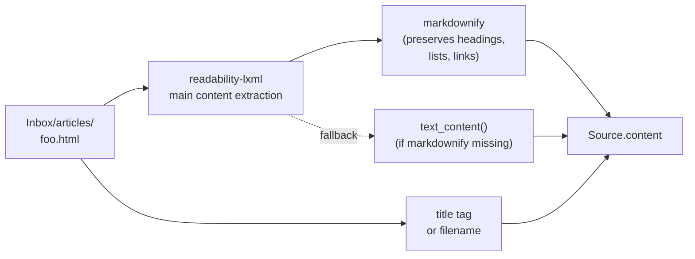
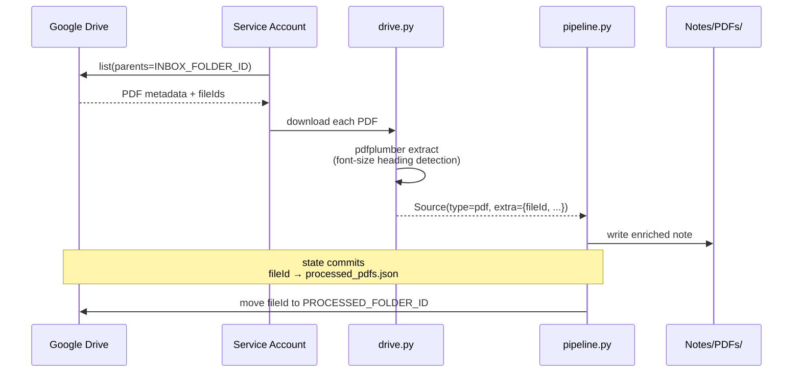
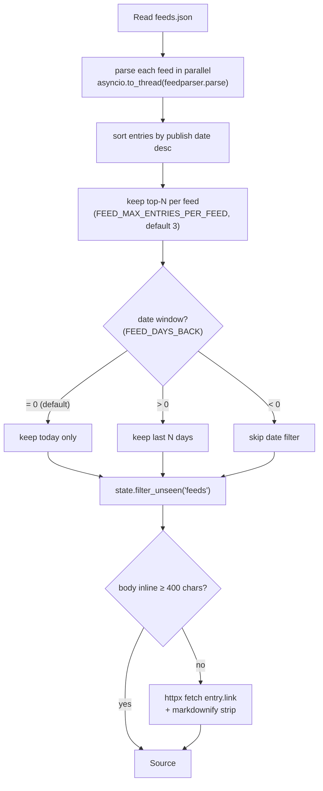

# Sources

How each source type is extracted, the conventions you need to follow when feeding it, and what's missing.

## Overview

| Source | Inbox location | File types | Status | State key |
|---|---|---|---|---|
| Web article | `Inbox/articles/` | `.html`, `.htm`, `.md` | ✅ written | vault path |
| YouTube | `Inbox/youtube/` | `.txt`, `.md` | ⚠️ gathered, not written | video URL |
| Maps place | `Inbox/places/` | `.json` | ⚠️ gathered, not written | `place_id` |
| Drive PDF | Drive folder | `.pdf` | ✅ written | Drive `fileId` |
| RSS feed | `feeds.json` (config) | n/a | ✅ written (today-only) | entry `guid`/`link` |

"Gathered but not written" means the extractor runs during `gather_sources`, but the per-item flow filters them out at the write step (`SUPPORTED_TYPES = {"article", "youtube", "feed"}`). The YouTube and place flows will follow in a subsequent iteration.

---

## Web articles

Two formats are supported, with different extraction paths.

### `.html`



Save the page however you like — `Cmd+S` from a browser, `curl`, the [Obsidian Web Clipper](https://obsidian.md/clipper) in HTML mode:

```bash
curl -sL "https://example.com/post" -o "$VAULT_PATH/Inbox/articles/2026-05-14_slug.html"
```

JS-rendered pages (SPAs, paywalled sites) frequently produce thin extractions. Prefer the `.md` flow for those.

### `.md`

Bypasses readability. The body is markdown already. Frontmatter is parsed with `python-frontmatter` and used to populate the `Source`:

```yaml
---
title: "Kubernetes Operators Pattern"     # used as slug filename
source: "https://example.com/k8s-ops"      # canonical URL (or `url:`)
clipped_at: 2026-05-14
---

Body of the article in markdown.
```

Without frontmatter: `title = filename`, `url = file://...`.

This is the recommended path when using the Obsidian Web Clipper in markdown mode — configure it to write into `Inbox/articles/` and you're done.

---

## YouTube

Two ingestion patterns, both pre-implemented in `sources.py` but currently filtered out of the per-item write flow (see `cli.py::SUPPORTED_TYPES`).

### `.txt` — URL only

```
https://www.youtube.com/watch?v=dQw4w9WgXcQ
```

The extractor reads the URL, queries `youtube-transcript-api` for the transcript, and packages it as `Source.content`. Metadata (channel, published date, duration, thumbnail) goes into `Source.extra`.

### `.md` — URL inside frontmatter or body

```yaml
---
title: "How Kubernetes Schedulers Actually Work"
url: "https://www.youtube.com/watch?v=…"
---

Optional personal notes here.
```

The URL is found by regex anywhere in the file. Transcript is fetched the same way.

> ⚠️ Per-item flow for YouTube is on the roadmap. Today, the extractor runs and the source is logged as skipped.

---

## Maps places

A JSON file per place:

```json
{
  "source": "google_maps",
  "place_id": "ChIJN1t_tDeuEmsRUsoyG83frY4",
  "name": "Osteria da Mario",
  "category": "Italian restaurant",
  "address": "Via Colleoni 4, Bergamo",
  "rating": 4.6,
  "url": "https://maps.google.com/?cid=…",
  "notes_personali": "recommended by Luca"
}
```

If `GOOGLE_MAPS_API_KEY` is set, the extractor calls the Places API for the most recent reviews and appends them to `Source.content`. The `place_id` is the state key — falls back to the file path if missing.

> ⚠️ Per-item flow for places is on the roadmap.

---

## Drive PDFs



### Setup (one-time)

1. Create a service account in Google Cloud Console; download the JSON key.
2. Create two folders in Google Drive: `Inbox/PDFs/` and `Processed/PDFs/`.
3. **Share both folders** as Editor with the service account's `client_email` (from the JSON key). Service accounts have no quota of their own — they need explicit access.
4. Copy the folder IDs from the URLs (the long token after `/folders/`) into `.env`:
   ```
   GDRIVE_CREDENTIALS_JSON=/path/to/sa.json
   GDRIVE_INBOX_PDF_FOLDER_ID=1AbC…
   GDRIVE_PROCESSED_PDF_FOLDER_ID=1XyZ…
   ```

### Daily use

Drop PDFs into the Drive inbox folder. The next `consuelo run` will download them, extract content with heading-aware text extraction, classify them like any other source, write the enriched note, and move the source PDF to the processed folder. `fileId` is the state key (immutable across renames or moves).

---

## RSS / Atom feeds

Declare your feeds in a JSON file:

```json
[
  { "name": "TLDR Tech",       "url": "https://tldr.tech/api/rss/tech" },
  { "name": "Hacker News",     "url": "https://hnrss.org/frontpage" },
  { "name": "Simon Willison",  "url": "https://simonwillison.net/atom/everything/" }
]
```

Path is `$VAULT_PATH/.config/feeds.json` by default; override with `FEEDS_CONFIG_PATH=...` (e.g. to keep the config inside an Obsidian-visible folder like `Inbox/feeds/`).

Each entry needs `url` (string); `name` is optional and defaults to the URL.

### Behaviour



### Tuning knobs

| Variable | Default | Effect |
|---|---|---|
| `FEED_MAX_ENTRIES_PER_FEED` | `3` | Per-feed cap (top-N most recent). `0`/negative disables. |
| `FEED_DAYS_BACK` | `0` | `0` = today only; `N>0` = N-day backfill window; `-1` = no date filter. |
| `FEEDS_CONFIG_PATH` | `$VAULT_PATH/.config/feeds.json` | Path to the feed list. |

### Newsletter-only sources

For paywalled or email-only newsletters (FT, WSJ, some Substacks):

- Many premium publications expose a personalised RSS feed under a "subscriber feeds" section (e.g. FT's `myFT > Feeds`).
- For pure email newsletters, [Kill the Newsletter](https://kill-the-newsletter.com/) generates a throwaway email address that converts incoming mail into an RSS feed.

---

## Adding a new source type

To add a new source (e.g. Reddit saved posts, Pocket export):

1. **Define the extraction.** In `sources.py`, add a function that returns `list[Source]` populated with at minimum `type`, `title`, `content`, `state_id`, `state_source`. Use existing types (`feed`, `pdf`) as a template.
2. **Wire it into `gather_sources`.** Open `pipeline.py::gather_sources` and add a parallel branch — either an `asyncio.to_thread(...)` for sync extractors, or an `await your_extractor(...)` for async ones.
3. **Define the state key.** Pick something immutable (Reddit `post_id`, Pocket `item_id`). Add to `state.py::_STATE_FILES` if you want it under a different file, or reuse an existing one.
4. **Decide if it's processable.** If you want it to flow through write + state, add the type to `cli.py::SUPPORTED_TYPES`. Otherwise it'll be gathered and logged as skipped.
5. **Render coverage.** Check `rendering.py` — most type-specific rendering branches (`if source.type == "youtube": …`) are in `render_classified_note`. Add a branch if your type needs special treatment, or rely on the default article-style rendering.
6. **Tests.** Add a unit test under `tests/test_sources.py`. The existing tests stub out external calls and assert on the resulting `Source` shape.

The pipeline doesn't care how a `Source` was produced — once it's in the list, embed/classify/write/state all just work.
